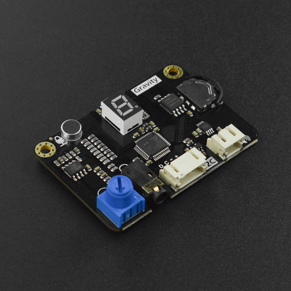

# DFRobot_VoiceRecorder

- [中文版](./README_CN.md)

DFR0699 Audio Recording and playback module Pro is the latest integrated voice interaction module launched by DFRobot.  Integrated recording and playback function as a whole, integrated button can record by one button, also support Grevity I2C interface by MCU control recording and playback.  Can store 10 100s audio, support headset and speaker interface output, built-in power amplifier plug and play.  Lets you easily add voice prompts or voice interactions to creative projects. <br>



## Product Link(https://www.dfrobot.com/product-2359.html)

    SKU:DFR0699

## Table of Contents

* [Summary](#Summary)
* [Installation](#Installation)
* [Methods](#Methods)
* [Compatibility](#Compatibility)
* [History](#History)
* [Credits](#Credits)

## Summary

- Recording function : The maximum length of a single recording is 100s, and the maximum length of a recording is 10. Save <br>  
- Speech synthesis : -999999999.999999999 to 999999999.999999999<br>  
- Operating voltage: 3.3-5V<br>
- Control interface : I2C<br>
- I2C address : 0x30-0x39 Configurable <br>  
- Output interface : 3.5mm headphone jack, PH2.0 speaker port <br>  

## Installation
There are two methods for using this library:<br>
1. Open Arduino IDE, search for "DFRobot_VoiceRecorder" on the status bar in Tools ->Manager Libraries and install the library.<br>
2. Download the library file before use, paste it into \Arduino\libraries directory, then open the examples folder and run the demo in the folder.<br>

## Methods

```C++
  /**
   * @fn setButtonMode
   * @brief Set button mode
   * @param mode Enable or disable the button function
   * @n     BUTTON_MODE_ON   0x00 enable button
   * @n     BUTTON_MODE_OFF  0x01 disable button
   */
  void setButtonMode(uint8_t mode);

  /**
   * @fn setLightMode
   * @brief Set light mode 
   * @param mode enable or disable lights
   * @n     LIGHT_MODE_OFF 0x00 disable lights
   * @n     LIGHT_MODE_ON  0x01 enable lights
   */
  void setLightMode(uint8_t mode);
  
  /**
   * @fn setVoiceNumber
   * @brief set voice number
   * @param number The audio number to play
   * @n     VOICE_NUMBER_0   0x00
   * @n     VOICE_NUMBER_1   0x01
   * @n     VOICE_NUMBER_2   0x02
   * @n     VOICE_NUMBER_3   0x03
   * @n     VOICE_NUMBER_4   0x04
   * @n     VOICE_NUMBER_5   0x05
   * @n     VOICE_NUMBER_6   0x06
   * @n     VOICE_NUMBER_7   0x07
   * @n     VOICE_NUMBER_8   0x08
   * @n     VOICE_NUMBER_9   0x09
   * @return state int type
   * @retval VOICE_SYNTHESISING is speech synthesis state
   * @retval VOICE_PLAYING      is playing state
   * @retval VOICE_RECORDING    is recording state
   * @retval VOICE_NONE         is idle condition set number success
   */
  uint8_t setVoiceNumber(uint8_t number);

  /**
   * @fn getI2CAddress
   * @brief get i2c device address
   * @return i2c device address
   */
  uint8_t getI2CAddress(void);

  /**
   * @fn getNowState
   * @brief get now state
   * @return state int type
   * @retval VOICE_SYNTHESISING is speech synthesis state
   * @retval VOICE_PLAYING      is playing state
   * @retval VOICE_RECORDING    is recording state
   * @retval VOICE_NONE         is idle condition
   */
  uint8_t getNowState(void);

  /**
   * @fn getButtonMode
   * @brief get Button Mode
   * @return Mode button mode
   * @retval BUTTON_MODE_ON  0x00
   * @retval BUTTON_MODE_OFF 0x01
   */
  uint8_t getButtonMode(void);

  /**
   * @fn getLightMode
   * @brief get light Mode
   * @return Mode light mode
   * @retval LIGHT_MODE_OFF  0x00
   * @retval BUTTON_MODE_OFF 0x01
   */
  uint8_t getLightMode(void);


  /**
   * @fn getVoiceNumber
   * @brief get voice number
   * @return number int type
   * @retval VOICE_NUMBER_0  0x00
   * @retval VOICE_NUMBER_1  0x01
   * @retval VOICE_NUMBER_2  0x02
   * @retval VOICE_NUMBER_3  0x03
   * @retval VOICE_NUMBER_4  0x04
   * @retval VOICE_NUMBER_5  0x05
   * @retval VOICE_NUMBER_6  0x06
   * @retval VOICE_NUMBER_7  0x07
   * @retval VOICE_NUMBER_8  0x08
   * @retval VOICE_NUMBER_9  0x09
   */
  uint8_t getVoiceNumber(void);

  /**
   * @fn getVoiceState
   * @brief get voice state
   * @return state int type
   * @retval 0 is Current position has audio
   * @retval 1 is empty
   */
  uint8_t getVoiceState(void);

  /**
   * @fn getTimeRemaining
   * @brief get time reamaining
   * @return The time range is 0-100
   */
  uint8_t getTimeRemaining(void);

  /**
   * @fn recordvoiceStart
   * @brief start record
   * @return state
   * @retval VOICE_SUCCESS is start record
   * @retval VOICE_BUSY is repeat recording or playback
   * @retval VOICE_NONE is Audio already exists delete and record
   */
  uint8_t recordvoiceStart(void);

  /**
   * @fn playVoiceStart
   * @brief start play
   * @return state
   * @retval VOICE_SUCCESS is start play
   * @retval VOICE_BUSY is repeat recording or playback
   * @retval VOICE_NONE is no songs in the current number
   */
  uint8_t playVoiceStart(void);

  /**
   * @fn deleteVoice
   * @brief delete voice
   * @return state
   * @retval VOICE_SUCCESS is delete success
   * @retval VOICE_BUSY is repeat recording or playback
   * @retval VOICE_NONE is no songs in the current number
   */
  uint8_t deleteVoice(void);

  /**
   * @fn recordVoiceEnd
   * @brief End of the tape
   * @return state
   * @retval VOICE_SUCCESS is end success
   * @retval VOICE_NONE is no begin record
   */
  uint8_t recordVoiceEnd(void);

  /**
   * @fn playVoiceEnd
   * @brief End play
   * @return VOICE_SUCCESS is end success
   * @retval VOICE_NONE is no begin record
   */
  uint8_t playVoiceEnd(void);

  /**
   * @fn voiceSynthesis
   * @brief speech synthesis
   * @param language
   * @n     CHINESE_LANGUAGE 0x01
   * @n     ENGLISH_LANGUAGE 0x02
   * @param number range is (999999999 to -999999999)
   * @return state
   * @retval VOICE_SUCCESS        is speech synthesis success
   * @retval VOICE_BUSY           is recording or playing. Please finish recording or playing first
   * @retval VOICE_SYNTHESISING   is In speech synthesis
   * @retval DATA_ERROR           is data error
   * @retval MODE_ERROR           is mode error
   */
  uint8_t voiceSynthesis(uint8_t language ,int64_t number);

  /**
   * @fn voiceSynthesis
   * @brief speech synthesis
   * @param language 
   * @n     CHINESE_LANGUAGE     0x01
   * @n     ENGLISH_LANGUAGE     0x02
   * @param string is Input string the scope is determined by the pattern
   * @param mode
   * @n     VOICE_SYNTHESIS_MODE range (999999999.999999999  to  -999999999.999999999)
   * @n     VOICE_REPLACE_MODE   Nine-bit string
   * @return state
   * @retval VOICE_SUCCESS       is speech synthesis success
   * @retval VOICE_BUSY          is recording or playing. Please finish recording or playing first
   * @retval VOICE_SYNTHESISING  is In speech synthesis
   * @retval DATA_ERROR          is data error
   * @retval MODE_ERROR          is mode error
   */
  uint8_t voiceSynthesis(uint8_t language ,String string ,uint8_t mode);
```

## Compatibility

MCU                | Work Well    | Work Wrong   | Untested    | Remarks
------------------ | :----------: | :----------: | :---------: | :----:
Arduino Uno        |      √       |              |             |
Arduino MEGA2560   |      √       |              |             |
Arduino Leonardo   |      √       |              |             |
FireBeetle-ESP32   |      √       |              |             |
Micro:bit          |              |              |      √      |


## History

- 2020/05/21 - V0.1.0 Version
- 2020/10/13 - V0.2.0 Version
- 2020/11/13 - V0.3.0 Version
- 2021/05/11 - V1.0.0 Version

## Credits

Written by ZhixinLiu(zhixin.liu@dfrobot.com), 2021. (Welcome to our [website](https://www.dfrobot.com/))
